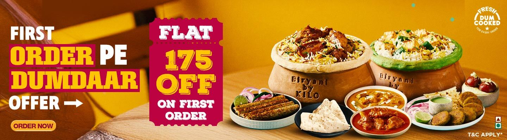

# 🍔 FoodWala — Food Delivery Platform

<div align="center">



**A modern, full-stack food delivery web application built with the MERN stack.**  
Order your favourite meals, track deliveries in real-time, and manage everything from a powerful admin dashboard.

[](LICENSE)
[](https://nodejs.org)
[](https://react.dev)
[](https://mongodb.com)
[](CONTRIBUTING.md)

[Live Demo](https://foodwala-two.vercel.app/) · [Report Bug](issues) · [Request Feature](issues)

</div>

---

## 📋 Table of Contents

- [Overview](#-overview)
- [Features](#-features)
- [Tech Stack](#-tech-stack)
- [Project Structure](#-project-structure)
- [Getting Started](#-getting-started)
- [Environment Variables](#-environment-variables)
- [API Documentation](#-api-documentation)
- [Development Phases](#-development-phases)
- [Roadmap](#-roadmap)
- [Contributing](#-contributing)
- [License](#-license)

---

## 🌟 Overview

FoodWala is a single-brand food delivery platform (think Biryani By Kilo, but yours). It enables customers to browse a dynamic menu, manage a cart, place orders, and pay online — while giving restaurant owners a full admin dashboard to manage food items, orders, and revenue analytics.

Built with scalability and clean architecture in mind — separating concerns across controllers, services, validators, and middleware layers.

---

## ✨ Features

### 👤 User Side
| Feature | Status |
|---|---|
| Google OAuth Login / Signup | ✅ Implemented |
| JWT Authentication | ✅ Implemented |
| Browse Dynamic Menu | 🔜 Phase 2 |
| Search & Filter Food | 🔜 Phase 2 |
| Add to Cart | 🔜 Phase 3 |
| Place Orders + Address | 🔜 Phase 4 |
| Razorpay / COD Payment | 🔜 Phase 5 |
| Order History & Tracking | 🔜 Phase 7 |
| Reviews & Ratings | 🔜 Phase 8 |
| Apply Coupons | 🔜 Phase 8 |

### 👑 Admin Side
| Feature | Status |
|---|---|
| Secure Admin Login (Role-based) | ✅ Implemented |
| Add / Edit / Delete Food Items | 🔜 Phase 6 |
| Manage Orders & Status Updates | 🔜 Phase 6 |
| Revenue & Analytics Dashboard | 🔜 Phase 6 |
| User Management | 🔜 Phase 6 |
| Assign Delivery Riders | 🔜 Phase 7 |

### 🔒 Security & Performance
| Feature | Status |
|---|---|
| Rate Limiting | 🔜 Phase 9 |
| Helmet.js Security Headers | 🔜 Phase 9 |
| Input Sanitization | 🔜 Phase 9 |
| Pagination & Caching | 🔜 Phase 9 |
| Image Optimization (Cloudinary) | 🔜 Phase 9 |

---

## 🛠 Tech Stack

### Frontend
- **React 18** — UI library
- **React Router v6** — Client-side routing
- **Axios** — HTTP client
- **Context API** — State management
- **Vite** — Build tool

### Backend
- **Node.js + Express** — Server & REST API
- **MongoDB + Mongoose** — Database & ODM
- **JWT** — Token-based authentication
- **Google OAuth 2.0** — Social login
- **Bcrypt** — Password hashing
- **Cloudinary** — Image storage *(upcoming)*
- **Razorpay** — Payment gateway *(upcoming)*
- **Socket.io** — Real-time tracking *(upcoming)*

---

## 📁 Project Structure

```
foodwala/
│
├── backend/
│   ├── src/
│   │   ├── config/          # DB, Cloudinary, Razorpay setup
│   │   ├── controllers/     # Request handlers
│   │   ├── middleware/      # Auth, admin, error guards
│   │   ├── models/          # MongoDB schemas
│   │   ├── routes/          # API endpoint definitions
│   │   ├── utils/           # Helpers (token, response, error)
│   │   ├── validators/      # Request validation logic
│   │   └── app.js           # Express app setup
│   └── server.js            # Server entry point
│
├── frontend/
│   ├── public/
│   └── src/
│       ├── api/             # Axios instances & API calls
│       ├── assets/          # Images, icons
│       ├── components/      # Reusable UI components
│       │   ├── cart/
│       │   ├── dish/
│       │   ├── layout/      # Navbar, Footer
│       │   ├── map/
│       │   ├── payment/
│       │   ├── restaurant/
│       │   └── ui/          # Button, Input, Modal, Loader
│       ├── context/         # AuthContext, CartContext
│       ├── pages/
│       │   ├── private/     # Protected routes (dashboard)
│       │   └── public/      # Home, About, Contact, Auth
│       └── App.jsx
│
└── README.md
```

---

## 🚀 Getting Started

### Prerequisites
- Node.js v18+
- MongoDB Atlas account (or local MongoDB)
- Google OAuth credentials

### 1. Clone the repository
```bash
git clone https://github.com/kumar-veerendra/foodwala.git
cd foodwala
```

### 2. Setup Backend
```bash
cd backend
npm install
```

Create a `.env` file in `backend/` (see [Environment Variables](#-environment-variables))

```bash
npm run dev
```

### 3. Setup Frontend
```bash
cd frontend
npm install
npm run dev
```

Frontend runs on `http://localhost:5173`  
Backend runs on `http://localhost:5000`

---

## 🔐 Environment Variables

Create `backend/.env`:

```env
# Server
PORT=5000
NODE_ENV=development

# MongoDB
MONGO_URI=mongodb+srv://<username>:<password>@cluster.mongodb.net/foodwala

# JWT
JWT_SECRET=your_super_secret_key
JWT_EXPIRES_IN=7d

# Google OAuth
GOOGLE_CLIENT_ID=your_google_client_id
GOOGLE_CLIENT_SECRET=your_google_client_secret

# Client URL
CLIENT_URL=http://localhost:5173

# Cloudinary (Phase 9)
CLOUDINARY_CLOUD_NAME=
CLOUDINARY_API_KEY=
CLOUDINARY_API_SECRET=

# Razorpay (Phase 5)
RAZORPAY_KEY_ID=
RAZORPAY_KEY_SECRET=
```

---

## 📡 API Documentation

### Auth Routes `/api/auth`
| Method | Endpoint | Description | Auth |
|---|---|---|---|
| POST | `/register` | Register new user | ❌ |
| POST | `/login` | Login with email/password | ❌ |
| GET | `/google` | Google OAuth redirect | ❌ |
| GET | `/google/callback` | Google OAuth callback | ❌ |
| GET | `/profile` | Get logged-in user | ✅ |
| POST | `/logout` | Logout user | ✅ |

### Food Routes `/api/foods` *(Phase 2)*
| Method | Endpoint | Description | Auth |
|---|---|---|---|
| GET | `/` | Get all food items | ❌ |
| GET | `/:id` | Get single food | ❌ |
| POST | `/` | Add food (Admin) | 🔒 Admin |
| PUT | `/:id` | Update food (Admin) | 🔒 Admin |
| DELETE | `/:id` | Delete food (Admin) | 🔒 Admin |

### Cart Routes `/api/cart` *(Phase 3)*
| Method | Endpoint | Description | Auth |
|---|---|---|---|
| GET | `/` | Get user cart | ✅ |
| POST | `/add` | Add item to cart | ✅ |
| PUT | `/update` | Update item quantity | ✅ |
| DELETE | `/remove/:id` | Remove item | ✅ |
| DELETE | `/clear` | Clear cart | ✅ |

### Order Routes `/api/orders` *(Phase 4)*
| Method | Endpoint | Description | Auth |
|---|---|---|---|
| POST | `/` | Place new order | ✅ |
| GET | `/my` | Get user order history | ✅ |
| GET | `/:id` | Get single order | ✅ |
| PUT | `/:id/cancel` | Cancel order | ✅ |
| GET | `/all` | Get all orders (Admin) | 🔒 Admin |
| PUT | `/:id/status` | Update order status | 🔒 Admin |

---

## 🗺 Development Phases

| Phase | Features | Status |
|---|---|---|
| **Phase 1** | Authentication (JWT + Google OAuth) | ✅ Complete |
| **Phase 2** | Food / Menu System | 🔄 In Progress |
| **Phase 3** | Cart System | 🔜 Upcoming |
| **Phase 4** | Order System | 🔜 Upcoming |
| **Phase 5** | Payment (Razorpay + COD) | 🔜 Upcoming |
| **Phase 6** | Admin Dashboard | 🔜 Upcoming |
| **Phase 7** | Delivery Tracking (Socket.io) | 🔜 Upcoming |
| **Phase 8** | Reviews, Coupons, Notifications | 🔜 Upcoming |
| **Phase 9** | Security + Performance Optimization | 🔜 Upcoming |
| **Phase 10** | Deployment (Render + Vercel) | 🔜 Upcoming |

---

## 🔭 Roadmap

- [x] Project structure setup
- [x] Google OAuth authentication
- [x] JWT-based protected routes
- [ ] Dynamic food menu with categories
- [ ] Search, sort, and filter
- [ ] Cart with quantity management
- [ ] Order placement with address
- [ ] Razorpay payment integration
- [ ] Admin dashboard with analytics
- [ ] Live delivery tracking
- [ ] Email notifications
- [ ] Mobile responsive UI
- [ ] Deploy to production

---

## 🤝 Contributing

Contributions are welcome! Here's how:

```bash
# 1. Fork the project
# 2. Create your feature branch
git checkout -b feature/AmazingFeature

# 3. Commit your changes
git commit -m "Add AmazingFeature"

# 4. Push to the branch
git push origin feature/AmazingFeature

# 5. Open a Pull Request
```

---

## 👨‍💻 Author

**Veerendra Kumar** — Building FoodWala from scratch as a full-stack MERN project.

---

## 📄 License

Distributed under the MIT License. See `LICENSE` for more information.

---

<div align="center">
  Made with ❤️ and lots of ☕ by Veer
</div>
